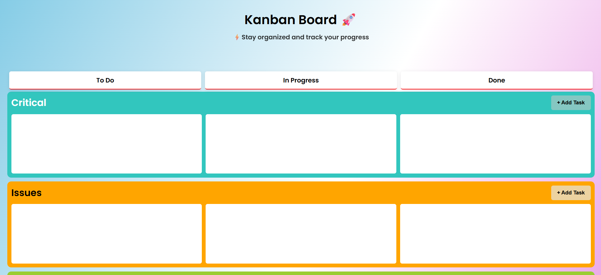

# kanban-board-js
A responsive Kanban Board built with JavaScript for task management, featuring dynamic task creation, deletion, and interactive UI using DOM manipulation.
# 🗂️ Kanban Board – Task Management Application

A responsive Kanban Board built using JavaScript to manage tasks across different stages like To-Do, In Progress, and Completed.

---

## 🚀 Live Demo
👉 https://your-netlify-link.netlify.app/

---

## 📸 Preview!


---

## ✨ Features
- ➕ Add new tasks using a modal  
- ❌ Delete tasks with a click  
- 🔄 Dynamic task rendering using DOM manipulation  
- 📱 Responsive and clean UI  

---

## 🛠️ Tech Stack
- HTML5  
- CSS3  
- JavaScript (ES6+)  

---

## 🧠 What I Learned
- DOM manipulation and event handling  
- Managing dynamic UI updates  
- Structuring frontend projects  
- Building interactive user interfaces  

---

## ⚡ Future Improvements
- 💾 Add localStorage for data persistence  
- ✏️ Edit task functionality  
- 🎯 Drag and drop between sections  
- 🔔 Confirmation popup for delete  

---

## 📂 Project Setup
1. Clone the repository  
   ```bash
   git clone https://github.com/your-username/your-repo-name.git
